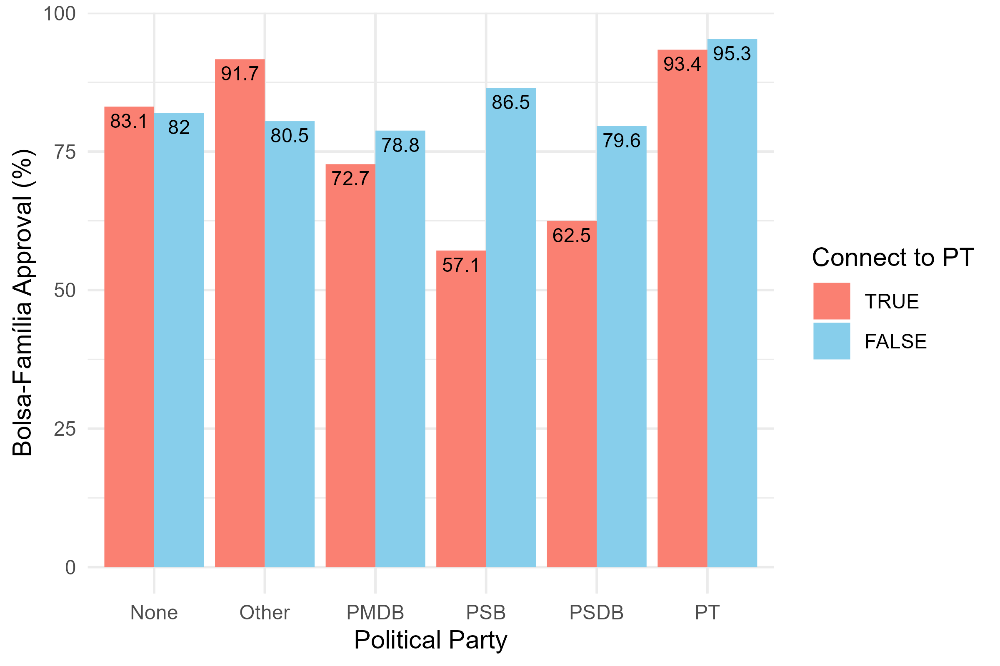
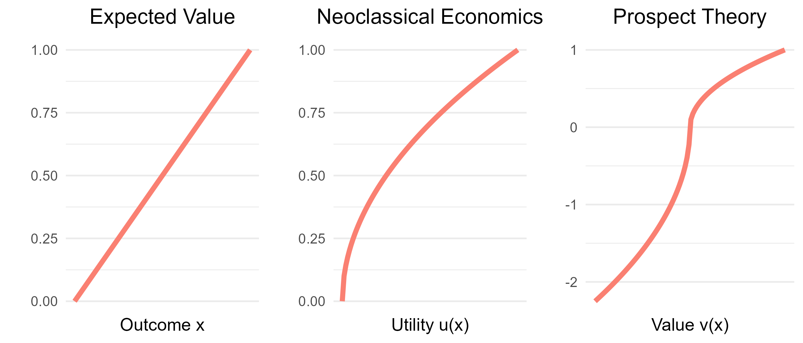
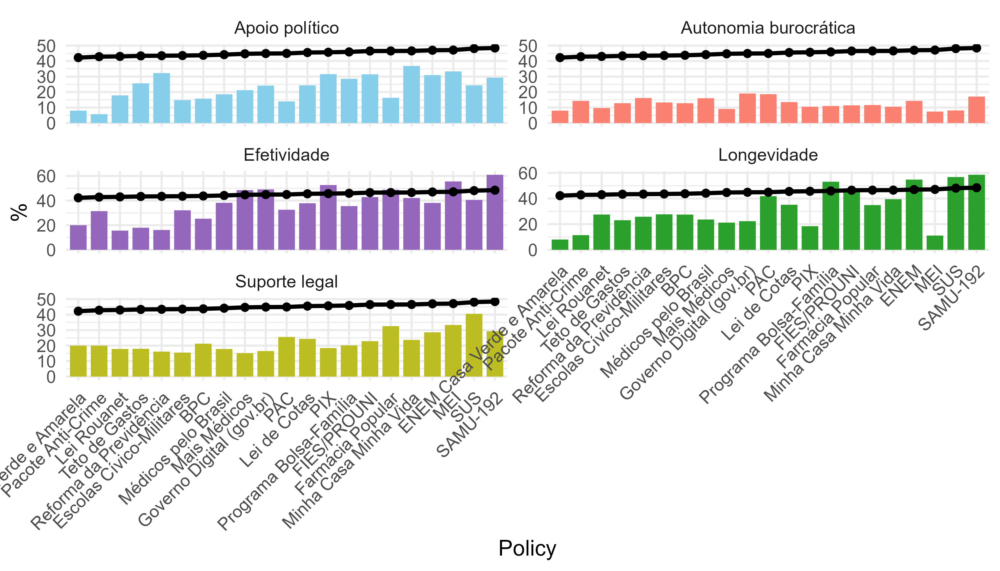
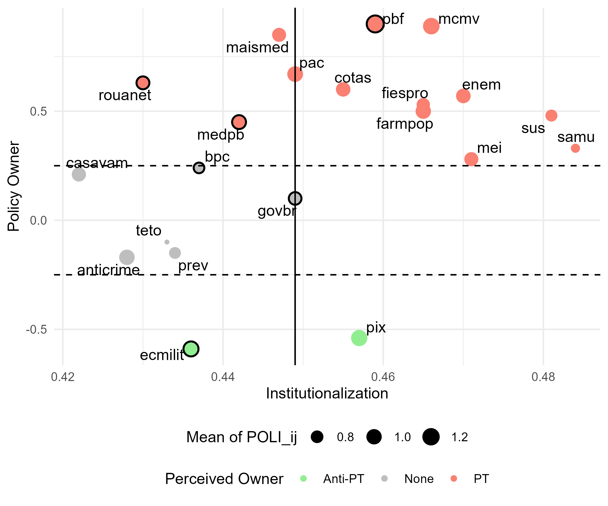
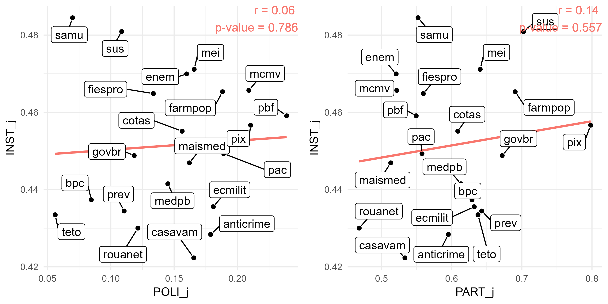
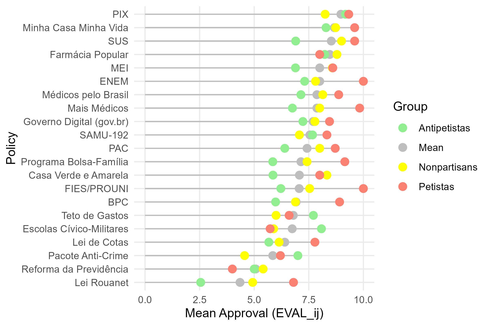

# Motivation

## Motivation

{.center width="80%"}

- Strictness in policy design and implementation \footnotesize (De La O, 2013)\normalsize;
- Temptation to politicize in a polarized scenario;
- The political "balance" \footnotesize (Abramovay and Lotta, 2022)\normalsize.

------------------------------------------------------------------------

## Summary

-   RQ: Does political balance affect the approval of public policies?
-   Objectives

1)  Mapping the relationship between ownership and institutionalization;
2)  Analyzing the effects of partisanship on policy approval;
3)  Evaluating how institutionalization shapes public opinion.

# Theory and hypotheses

## The politics of policies

-   The power of partisanship [@abramowitz_negative_2018];
-   From "issue ownership" to policy ownership [@petrocik_issue_1996];
-   Politicization? Not always.

{.center width="55%"}

------------------------------------------------------------------------

## The institutionalization of policies

{.center width="60%"}

-   The rules [@north_institutions_1990] and their entrenchment [@levitsky_variation_2009];
-   Policy feedback literature;
-   Non-Politicization? Not always;
-   Status quo bias and loss aversion [@kahneman_prospect_1979].

## Hypotheses

-   H1: Institutionalization is not associated with policy ownership;
-   H2a: Alignment with the policy owner positively affects policy approval;
-   H2b: Misalignment with the policy owner negatively affects policy approval;
-   H2c: Policy ownership negatively affects non-partisans’ policy approval;
-   H3: Institutionalization positively affects the policy approval.

# Empirical strategy

-   Choice-based conjoint experiment [@hainmueller_causal_2014];
- Two surveys:
1)  Conjoint (N = 245)
2)  Conjoint + Questions about real policies (N = 285)

------------------------------------------------------------------------

## Study 1

{.center width="60%"}

## Study 2

{.center width="70%"}

------------------------------------------------------------------------

## Study 3

{.center width="55%"}

------------------------------------------------------------------------

## Study 3

{.center width="50%"}

-   Individual-level test (H1):
1)  Institutionalization -\> Policy ownership (0.14, p \< 0.01);
2)  Institutionalization -\> Alignment with the owner (0.06, p \> 0.05).

---

## Study 3

{.center width="55%"}

- Individual-level test (H2 and H3):
1) Alignment with the owner -> Approval (0.40, p < 0.001);
2) Policy ownership -> Approval (0.12, p < 0.001). 
3) Institutionalization -> Approval (0.33, p < 0.001).

# Conclusions

- Contributions:
1) Methodological;
2) Theoretical;
3) Practical.

- Limitations:
1) Potential reverse causality;
2) Potential confounders;
3) Limited sample;
4) Unexplored method.

- Future agenda.

# References {.allowframebreaks}
